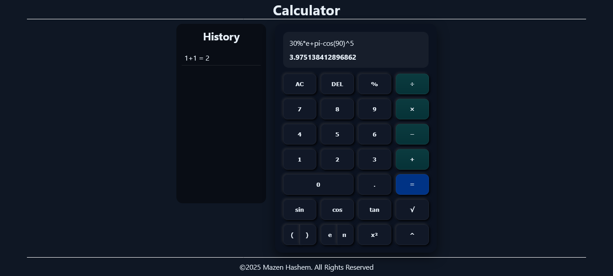

# Calculator App



A responsive, fully-featured calculator web app built with **Next.js 13**, **React**, and **Math.js**. This project includes basic arithmetic, advanced mathematical functions, history tracking, and a modern, interactive UI.

---

## 📌 Project Context

This project was developed as a training on **Frontend Web Developer**, to practice React, Next.js, and advanced JavaScript features.

---

## 🚀 Features

- **Basic Operations**: Addition (+), Subtraction (−), Multiplication (×), Division (÷)
- **Advanced Functions**: `sin`, `cos`, `tan`, `sqrt`, exponentiation (`^`), powers (`x²`), constants (`π`, `e`)
- **Live Evaluation**: Preview calculation results before pressing equals
- **Smart Delete**: Deletes entire functions like `sin(`, `cos(`, `tan(`, `sqrt(` in a single click
- **Calculation History**: Track previous calculations in a scrollable sidebar
- **Responsive Layout**: Works on desktops, tablets, and mobile devices
- **Customizable Buttons**: Supports full-width, half-width, and multi-column buttons

---

## 🛠️ Technologies Used

- **Next.js 13** for React-based app structure
- **React Context API** for global state management (expression, result, history)
- **Math.js** for safe and precise expression evaluation
- **CSS Grid** for calculator button layout
- **CSS Variables** for consistent theming and styling

---

## 📂 Project Structure

```
src/
├── app/
│   ├── globals.css       # Global styling and CSS variables
│   ├── layout.jsx        # Root layout with CalculatorProvider
│   ├── page.jsx          # Main page rendering Header, Main, Footer
│   ├── app.css           # Main app wrapper styles
│   └── components/
│       ├── header/       # App header with title
│       ├── main/         # Main content area
│       │   ├── Calculator/ # Calculator component + buttons
│       │   └── History/   # History panel + item components
│       └── footer/       # Footer component
├── context/
│   └── CalculatorContext.jsx # Context provider for global calculator state
```

---

## ⚙️ Setup & Installation

1. Clone the repository:
```bash
git clone https://github.com/Mazen-Hashem/ApexcifyTechnologys_calculator.git
cd ApexcifyTechnologys_calculator
```
2. Install dependencies:
```bash
npm install
```
3. Start the development server:
```bash
npm run dev
```
4. Open the app in your browser at `http://localhost:3000`

---

## 🧩 Components Overview

### **CalculatorContext**
- Provides `calculatorData` (expression, result) and `historyData` globally
- Functions: `setCalculatorData` and `setHistoryData`

### **Header**
- Displays the app title `Calculator`

### **Main**
- Layout for `History` and `Calculator` components side by side (or stacked on mobile)

### **Calculator**
- Handles all button actions and state updates
- Features live evaluation and smart delete
- Maps buttons from `buttonsData.jsx`

### **Buttons**
- Reusable component with props: `className`, `dataAction`, `text`, `onClick`
- Styled with CSS Grid, supports multi-column and half-width buttons

### **History**
- Scrollable list of previous calculations
- Each item rendered by `Item` component

### **Footer**
- Static footer with copyright

---

## 🎨 Styling & Layout

- **Theme**: Dark mode with CSS variables
- **Layout**: Flexbox and CSS Grid
- **Buttons**: Responsive, hover/active states, shadow effects
- **Screen Display**: Scrollable expression with auto-scroll for long expressions

---

## 📌 Usage

1. Click numbers and operators to build an expression
2. Use `sin`, `cos`, `tan`, `sqrt`, `^`, `x²` for advanced calculations
3. Press `=` to evaluate in the expression box and add it to the history.
4. Use `AC` to clear, `DEL` for smart deletion
5. View previous calculations in the History panel

---

## 🧪 Future Improvements

- Keyboard input support
- Dark/light theme toggle
- Additional scientific functions (`log`, `ln`, factorial `!`)
- Animations and visual effects for buttons

---

## 📜 License
MIT License. All rights reserved.
